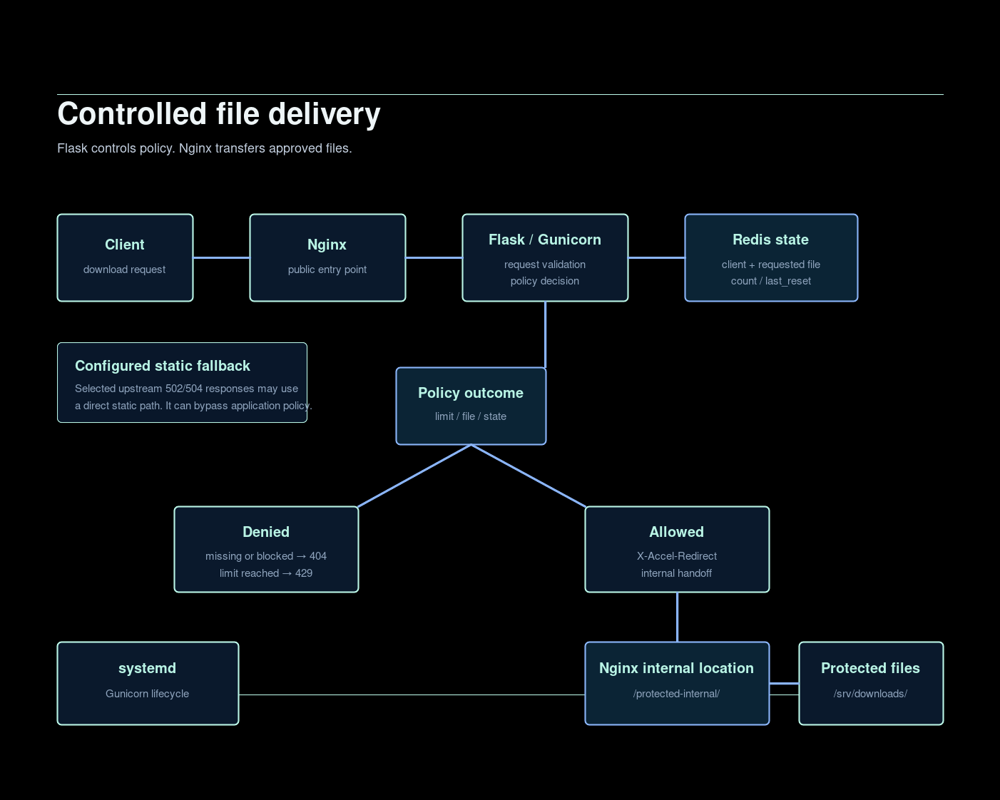

# Controlled File Delivery with Flask, Redis and Nginx

## Purpose

This is a sanitized reference implementation derived from a real engineering pattern. Production-specific identifiers and configuration have been removed.

The pattern separates policy from file transfer: Flask evaluates a request, Redis tracks per-client and per-file state, and Nginx sends an approved protected file through an internal location.

## Architecture and request flow

Client request → Nginx → Flask/Gunicorn → policy decision and Redis state → allowed response with X-Accel-Redirect → Nginx internal location → protected file storage.

Flask controls policy. Nginx transfers the file. Gunicorn hosts the application, and systemd manages its lifecycle.

## Repository layout

~~~text
app/       Flask policy application and example client limits
nginx/     reverse-proxy and protected internal-location example
systemd/   dedicated-service-account reference unit
scripts/   safe prerequisite and local-verification helpers
images/    sanitized architecture diagram
~~~

## Policy semantics

The example allow-ip-limits file uses documentation addresses only:

~~~text
192.0.2.10=10
192.0.2.20=-1
192.0.2.30=0
192.0.2.40=5
~~~

A positive value is a maximum download count, minus one is unlimited, and zero blocks delivery. Clients without a matching rule use the configured default limit.

## Redis state and counter reset

State is stored by client and requested file. Each record tracks count and last_reset. The counter resets after a configured four-hour interval or when the underlying file modification time is newer than the recorded reset time. Redis unavailability is treated as an application error rather than silently permitting delivery.

## X-Accel-Redirect

After Flask approves a request, it does not stream the file. It returns a response header that delegates delivery to Nginx:

~~~python
response.headers["X-Accel-Redirect"] = f"/protected-internal/{filename}"
~~~

The Nginx example maps that URI only inside an internal location:

~~~nginx
location /protected-internal/ {
    internal;
    alias /srv/downloads/;
}
~~~

This keeps access decisions in the application while using Nginx for the protected transfer.

## Fallback trade-off

The Nginx example includes configured degraded/static fallback for selected upstream errors. A direct static fallback can preserve delivery when the application is unavailable, but it can bypass application-level policy enforcement. A stricter deployment may choose to fail closed instead. Choose deliberately for the applicable security and business requirement.

## Setup reference

Review the examples before use. Create a dedicated filedelivery service account, a Python environment, the protected /srv/downloads/ directory, and a Redis connection according to local policy. Copy and adapt the Nginx and systemd examples only after reviewing paths, ownership, network controls, and fallback behavior.

The install helper checks prerequisites only; it does not install packages or alter the host. The systemd unit is a recommended reusable hardening pattern, not a claim about an original deployment.

## Validation

Run scripts/install.sh to check basic prerequisites. Run scripts/verify.sh after adapting local configuration. Validate Python syntax, shell syntax, Nginx configuration, the loopback Gunicorn listener, Redis connectivity, the protected directory, and the service state before exposing the endpoint.

## Security considerations

- Reject absolute paths, traversal attempts, hidden path components, and files outside the resolved download root.
- Keep Gunicorn on a loopback listener and publish only Nginx.
- Use a dedicated service account with only the file permissions it needs.
- Keep Redis credentials and deployment-specific configuration outside this reference repository.
- Treat the static fallback as an explicit policy trade-off, not as an availability guarantee.
