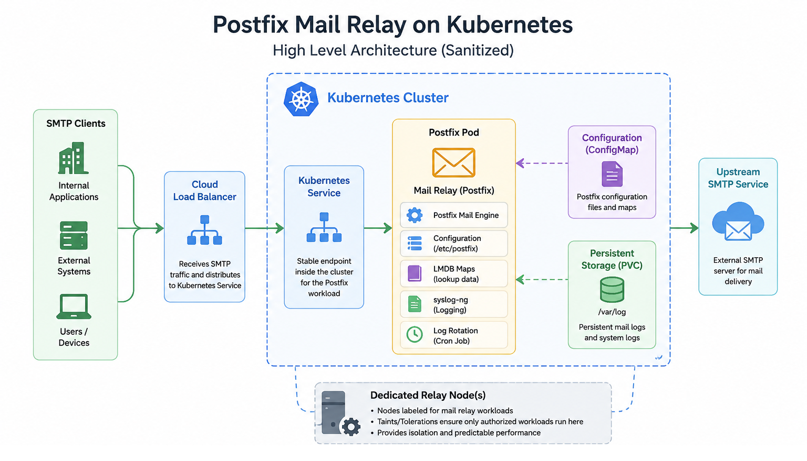

# Postfix Mail Relay on Kubernetes

**Classification:** Sanitized engineering pattern

This repository documents a sanitized implementation pattern based on hands-on work moving an existing Postfix mail relay into Kubernetes. Company-specific infrastructure and configuration details are intentionally excluded.

## Overview

The aim was to move a mail-relay workload from a traditional server environment into Kubernetes while keeping configuration, logging, SMTP access control, workload placement, and troubleshooting understandable.

This is technical evidence for an engineering pattern. It is not a production runbook.

## Architecture

The pattern uses a Kubernetes Deployment for the Postfix workload and a Kubernetes Service as its stable network path. Configuration is mounted in a container-friendly form. Persistent storage and syslog-ng keep operational logs available when a Pod is recreated.

## Engineering goals

- Handle SMTP traffic through a Postfix relay workload.
- Manage Postfix configuration without relying on server-specific assumptions.
- Keep operational logs available for troubleshooting.
- Place the workload deliberately within the Kubernetes environment.
- Separate relay, Kubernetes, and upstream connectivity problems.

## Kubernetes design

The kubernetes folder contains newly written, public-safe examples for a Deployment, Service, ConfigMap, and persistent log storage. They use generic names and placeholders. Replace the placeholders only in a controlled environment.

## Postfix and container considerations

Postfix configuration often assumes a traditional server. Containerized operation needs those assumptions reviewed, especially network interface settings, available lookup-map support, and foreground process behaviour. See [postfix/README.md](postfix/README.md).

## Persistent logging

Container-local logs may disappear when a Pod is recreated. The example pattern uses persistent storage with syslog-ng so useful relay logs remain available for investigation.

## Workload scheduling

The Deployment example shows generic node selection and toleration concepts. They illustrate controlled placement; they do not describe a specific cluster or node pool.

## SMTP access control

A relay should accept mail only from approved sources while normal relay protection remains enabled. The examples intentionally omit source ranges, access maps, network rules, and credentials.

## Troubleshooting approach

Check the SMTP path in two parts:

~~~text
Client → Kubernetes Relay
Kubernetes Relay → Upstream SMTP Service
~~~

Testing the legs separately helps isolate whether a problem belongs to Kubernetes, Postfix, or network connectivity. See [troubleshooting/validation.md](troubleshooting/validation.md).

## Validation

Validation covers workload state, Service reachability, Postfix startup, LMDB availability, persistent logging, queue behaviour, SMTP connectivity, end-to-end flow, and behaviour during redeployment.

## Repository structure

~~~text
postfix-mail-relay-kubernetes/
├── images/          Sanitized architecture diagram
├── kubernetes/      Public-safe example manifests
├── postfix/         Postfix and container notes
└── troubleshooting/ Validation and troubleshooting guide
~~~

## Security and sanitization note

The repository contains no company names, production hostnames, domains, IP addresses, network ranges, project identifiers, credentials, secret names, actual ports, raw production YAML, logs, or commands. All manifests and examples were written specifically for public explanation.

## Related Work Study

Read the recruiter-friendly KRSTACK Work Study: [Running a Postfix Mail Relay on Kubernetes](https://krstack.in/work/postfix-mail-relay-kubernetes/).
